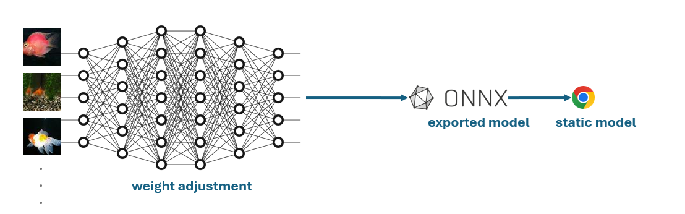
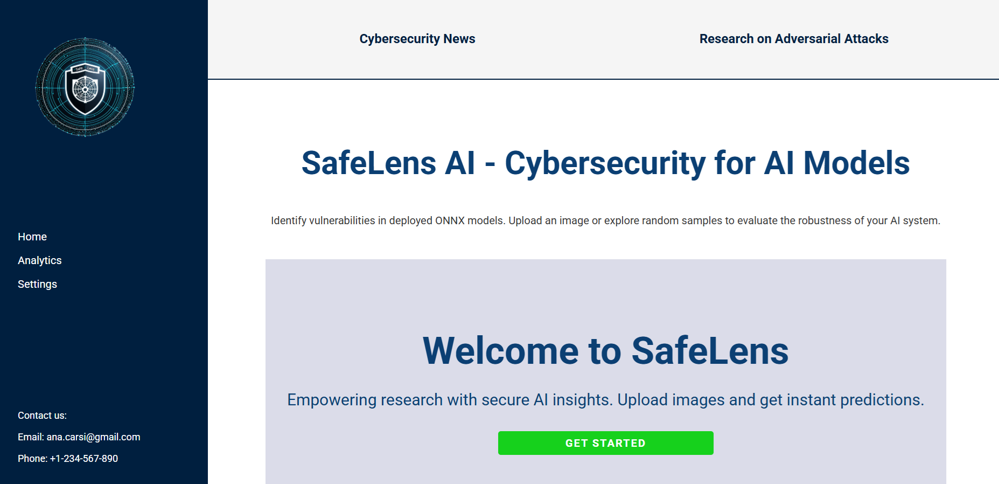
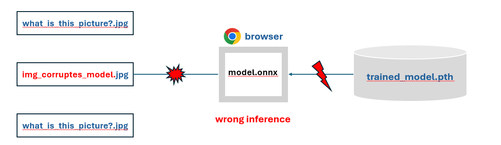

<p align="center">

</p>

# SafeLens: Cyberattacks on ONNX Model Web Application

## 🌟Project Overview and Scope

This project presents a cybersecurity analysis on a PyTorch-trained neural network after deployment in a web environment, using ONNX for model conversion and ONNX.js for execution in the browser.
<p align="center">

</p>

### Key Deliverables
1. **Functional ONNX Model**: A basic image classification neural network trained in PyTorch and converted to ONNX format.
2. **Web Application**: A browser-based user interface that loads and executes the ONNX model using ONNX.js.
3. **Security Testing**: Controlled security testing on the model to evaluate its robustness against malicious inputs and corrupted models.

<p align="center">

</p>

## Functionality
1. Obtaining the model by loading it from folder saved_models

2. Obtain metrics on accuracy on src/onnxmodel/validate_models_train.ipynb

3. Find effects of the attacks: src/poisoning_attack or src/evasion_attack for results. An overview of the pipeline for the evasion attacks would be the following.

<p align="center">

</p>

## Getting Started

### Prerequisites
- **Python 3.11** installed with PyTorch and ONNX libraries.
- **Node.js** for ONNX.js integration in the frontend.

### Installation
1. Clone this repository:
   ```bash
   git clone https://github.com/anacarsi/SafeLens_Poisoning_Attacks.git
2. Run
    ```bash
    npm i
    ```
    to install all the necessary dependencies.


### Run the development server:

First, build the application:

```bash
npm run build
```

Then run with:
```bash
npm run start
```
or

```bash
npm run dev
```
to run with debugging.

Open [http://localhost:3000](http://localhost:3000) with your browser to see the result.


## Image Classification Models

We provide two Image Classification models to work with in this application. Their ONNX files are found within the 'public' folder. Per default, the first model is deployed within the browser, if you'd like to change that, please go to file 'utils/modelhelper.ts'. Change the filename from first model to second model in line 9. Then, in the files 'FileUpload.tsx' and 'imageHelper.ts', comment out the dimensions variable for the first model and uncomment the dimensions variable for the second model. The first model is trained on the CIFAR10 (32x32) dataset, while the second model is trained on the tiny-imagenet (64x64) dataset.


## Credits/Resources

This is a [Next.js](https://nextjs.org/) project bootstrapped with [`create-next-app`](https://github.com/vercel/next.js/tree/canary/packages/create-next-app).


## Trademarks

This project may contain trademarks or logos for projects, products, or services. Authorized use of Microsoft 
trademarks or logos is subject to and must follow 
[Microsoft's Trademark & Brand Guidelines](https://www.microsoft.com/en-us/legal/intellectualproperty/trademarks/usage/general).
Use of Microsoft trademarks or logos in modified versions of this project must not cause confusion or imply Microsoft sponsorship.
Any use of third-party trademarks or logos are subject to those third-party's policies.
